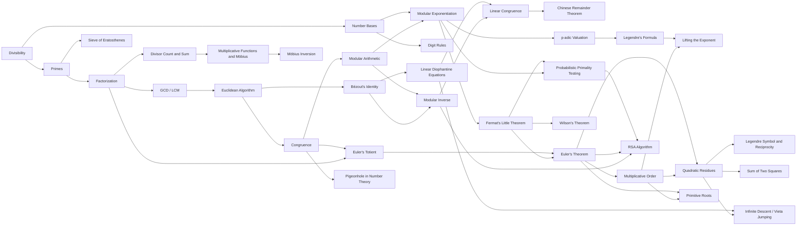

# Frontier

A skill tree for contest math. A knowledge-tracing model, utilizing Claude finds your exact mathematical frontier in four questions, then generates unlimited practice with symbolically verified answers.

## Inspiration
As avid members of the math contest scene, the gap between the math taught in schools (procedural, computational) and contest math (proof-based, creative problem-solving) is a chasm. It has become almost impossible for a traditional student to do well in math contests like the AMC or COMC. Even worse, the math taught in schools is becoming increasingly applicable only for a few applied sectors. We have been inspired by this pain point, faced by thousands of students across the world, to help fix the gap, and allow students to boost their mathematical knowledge.

## What it does
An initial test of four questions gauges a student's starting level in any area of mathematics (Number Theory, Combinatorics, Algebra, Geometry), to find out where their mathematical skill is in that area. From here, it follows by giving them questions right on the edge of their ability, analysing where they struggle, where they succeed, and adapt the questions based on how well they perform. Once we figure out how a user performs, we continue providing questions, along with a step by step solution if the solution is incorrect, allowing the student to grow, pushing their frontier further, and providing them new, different questions.

## How we built it
Rather than utilizng a linear quiz, we model number theory as a 35-node prerequisite DAG (Directed Acyclic Graph, a network of nodes connected by one-way edges, with no repeating cycles), e.g. divisibility → primes → factorization → ... → RSA. A student's mastery of each concept is tracked probabilistically, and they can only practice nodes whose prerequisites they've already shown they know. Nodes include individual concepts (35 of them), like divisibility, primes, factorization, GCD, LCM, Fermat's Little Theorem, RSA Algorithm and more. Directed edges are prerequisite relationships. An edge from divisibility → primes means "you need divisibility to learn primes." In the code this shows up as each node listing its prerequisites:

```
{
  "id": "totient",
  "prereqs": ["factorization", "congruence"]
}
```



## Challenges we ran into
Our first main challenge of the project was the sheer size of mathematics, and how much could be taught to students. We solved this challenge by hyper-focusing on Number Theory, allowing students to turn school knowledge into high level mathematical knowledge, used for computer cryptography and very relevant in mathematical competitions. This wasn't an application problem per se, computing power could handle much more than what is currently given, but a human problem, as we couldn't interpret all of mathematics into a Directed Acylic Graph within the given time frame.

Despite initial attempts at connection with Gemini, API difficulties mean our project couldn't connect to it for successful implementation of AI. In order to bypass this issue, we established a connection with Claude instead, using their API to provide our analysis of the users level, alongside creating new questions. Our final project uses Claude, despite challenges around initial API connection.

## What's next for Frontier
Expanding the focus beyond Number Theory. The efficiency of the project appears very optimistic, and we are sure we could use it to conduct all kinds of mathematical pedagogy. The main constraint here isn't that the product couldn't cover more areas of mathematics, but that human developers cannot input huge levels of information from all areas of mathematics in a structured way without a concrete timeline or funding. However, given a large enough time frame, we are certain we can begin this, creating a huge product, that will impact high school, undergraduate and graduate math students learn more, succeed in math competitions and boost their passion.
