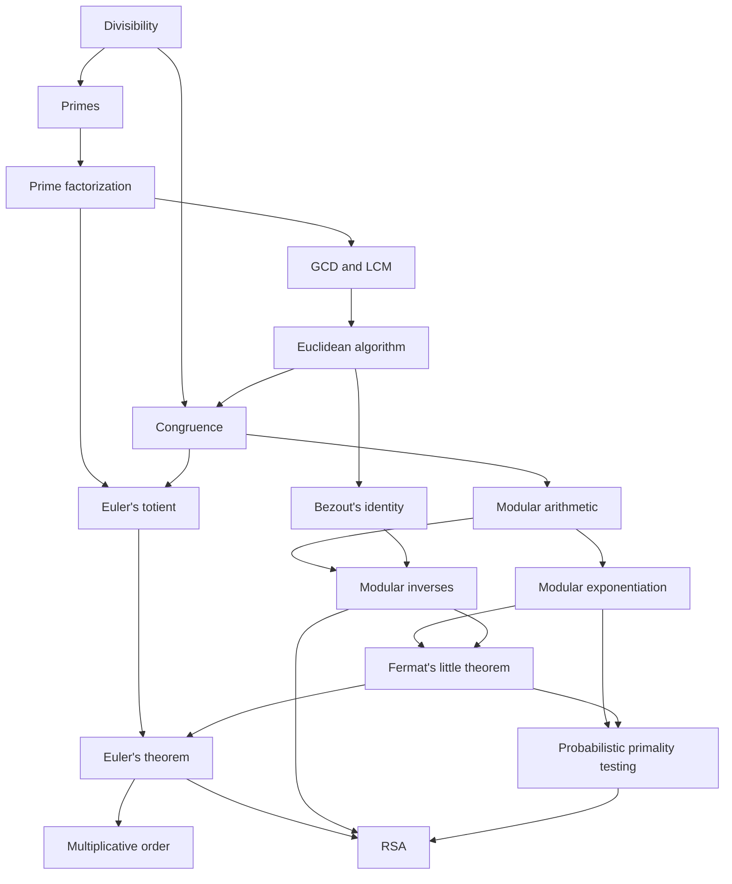

# Frontier

A skill tree for contest math. Six questions find the exact point where a student's number theory runs out, then the app generates unlimited practice at that edge, with every answer computed and checked symbolically rather than stored in a file.

## Inspiration
As avid members of the math contest scene, the gap between the math taught in schools (procedural, computational) and contest math (proof-based, creative problem-solving) is a chasm. It has become almost impossible for a traditional student to do well in math contests like the AMC or COMC. Even worse, the math taught in schools is becoming increasingly applicable only for a few applied sectors. We have been inspired by this pain point, faced by thousands of students across the world, to help fix the gap, and allow students to boost their mathematical knowledge.

## What it does
An initial test of six questions finds the exact point where a student's number theory runs out, and from there the app serves problems generated fresh at that edge, so it never runs out of them, with a wrong answer returning a hint aimed at the specific mistake rather than the answer itself. Underneath, a knowledge-tracing model holds a probability of mastery for every one of the 35 concepts and updates it on every answer. Because those concepts are wired together as a prerequisite graph, a single answer updates our confidence in several at once: a student who solves a Chinese Remainder Theorem problem has almost certainly mastered the Euclidean Algorithm underneath it, so the model lifts both, and the graph visibly lights up in more than one place. The same engine drives two surfaces, a Lessons page that pairs written teaching for each of the 22 authored concepts with a short two-of-three practice round, and Challenges, a dungeon run whose rooms are problems drawn from the concepts you have unlocked.

## How we built it
Rather than utilizing a linear quiz, we model number theory as a 35-node prerequisite DAG (Directed Acyclic Graph, a network of nodes connected by one-way edges, with no repeating cycles), e.g. divisibility → primes → factorization → ... → RSA. A student's mastery of each concept is tracked probabilistically, and they can only practice nodes whose prerequisites they've already shown they know. Nodes include individual concepts like divisibility, primes, factorization, GCD, LCM, Fermat's Little Theorem, RSA Algorithm and more. The 51 directed edges are prerequisite relationships. An edge from divisibility → primes means "you need divisibility to learn primes." In the code this shows up as each node listing its prerequisites:

```json
{
  "id": "totient",
  "prereqs": ["factorization", "congruence"]
}
```

Laid out by longest path the graph is 13 levels deep, divisibility alone at the top and RSA near the bottom. We authored the first two tiers in full, which is 22 of the 35 concepts, and left the olympiad tier as structure only so the map has real depth below wherever a student is working. Here is the spine of it, with those branches left out:



**The machine learning.** Mastery is a two-state hidden Markov model per concept, the standard Bayesian Knowledge Tracing model (Corbett and Anderson, 1995): a student has either mastered a concept or has not, we never observe which directly, and four parameters cover the gap between knowing something and answering it, among them the chance of slipping when you do know and of guessing when you do not. Every answer is a Bayesian update on that hidden state, and a concept counts as mastered at 95% confidence. We have no student data yet, so the app ships literature priors, and we implemented the fitting as well, gradient descent on the likelihood, checked by generating 200 synthetic students with known mastery and confirming the fitted parameters recover the true ones, with slip and guess landing within about 0.03. The diagnostic then picks each question by uncertainty sampling, choosing the concept whose answer is least predictable and would move the most of the graph. What makes all of this more than 35 independent counters is that evidence travels along the prerequisite edges, and we should be straight that the propagation is our own heuristic resting on a monotonicity assumption rather than exact inference over a joint distribution. We also broke from the textbook on purpose: standard BKT applies a learning step after every attempt, so a student could answer wrong and watch the concept get brighter, which is correct BKT and looks broken, so the step now applies only on correct answers.

## Challenges we ran into
Our first main challenge of the project was the sheer size of mathematics, and how much could be taught to students. We solved this challenge by hyper-focusing on Number Theory, allowing students to turn school knowledge into high level mathematical knowledge, used for computer cryptography and very relevant in mathematical competitions. This wasn't an application problem per se, computing power could handle much more than what is currently given, but a human problem, as we couldn't interpret all of mathematics into a Directed Acylic Graph within the given time frame.

## What's next for Frontier
Expanding the focus beyond Number Theory. The efficiency of the project appears very optimistic, and we are sure we could use it to conduct all kinds of mathematical pedagogy. The main constraint here isn't that the product couldn't cover more areas of mathematics, but that human developers cannot input huge levels of information from all areas of mathematics in a structured way without a concrete timeline or funding. However, given a large enough time frame, we are certain we can begin this, creating a huge product, that will impact high school, undergraduate and graduate math students learn more, succeed in math competitions and boost their passion.
